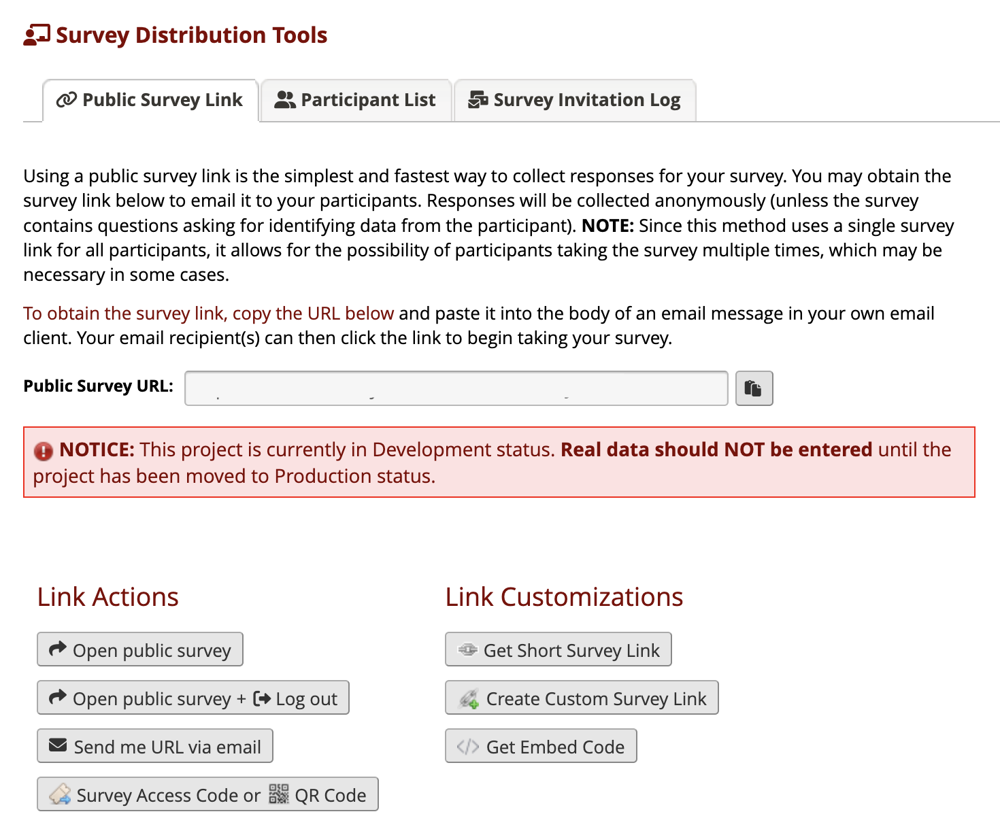
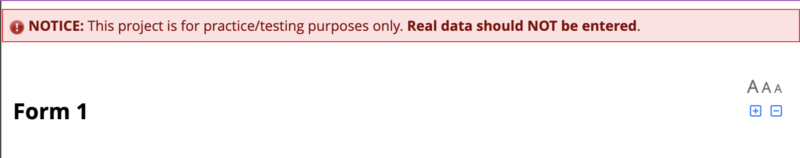

# REDCap Warning Banner

This REDCap External Module allows administrators to display a warning banner to survey respondents, and project users on the invite participants page, if the project is of purpose 'Practice', or otherwise, is still in development mode. Each warning is separately enabled, and can have customised warning text.

Warnings can be displayed on Survey Distribution Tools pages:

And survey pages:

## Why?

The built-in protections against users accidentally sending survey links and invitations to respondents before their project has been moved to production, are not strong. There is a yellow warning on the Add/Edit Records page warning users that they should not collect real data until the project is in production, but such warnings do not appear in all places where a user may accidentally distribute a survey to respondents, and even where they do appear, they may be ignored.

This module allows administrators to add more visibility to their site's business rules, and thus improve compliance.

## Installation

Install the module from the REDCap module repository and enable in the Control Center, then enable on all projects.

## Usage

Administrators may separately enable, and customise, warnings for practice projects, or projects of other purposes that are in development, and separately for project users, or survey respondents. Administrators may additionally convert the existing warning on the Add/Edit Records page from yellow to red.

Administrators may also override these settings on a per-project level, either disabling the warnings or customising the warning text.

## Localisation

This module supports localisation through the REDCap External Module Framework's Internationalisation (i18n) features. All configuration options, default warning text, and module name and description, may be translated by duplicating the file lang/English.ini to your local language and replacing the values of each text parameter. If you translate this module to a new language, consider contributing your translation to this repository so that it can be included in future releases for other sites.

## TODO

- Allow configuration options to modify the banner style, or select from several templates.
